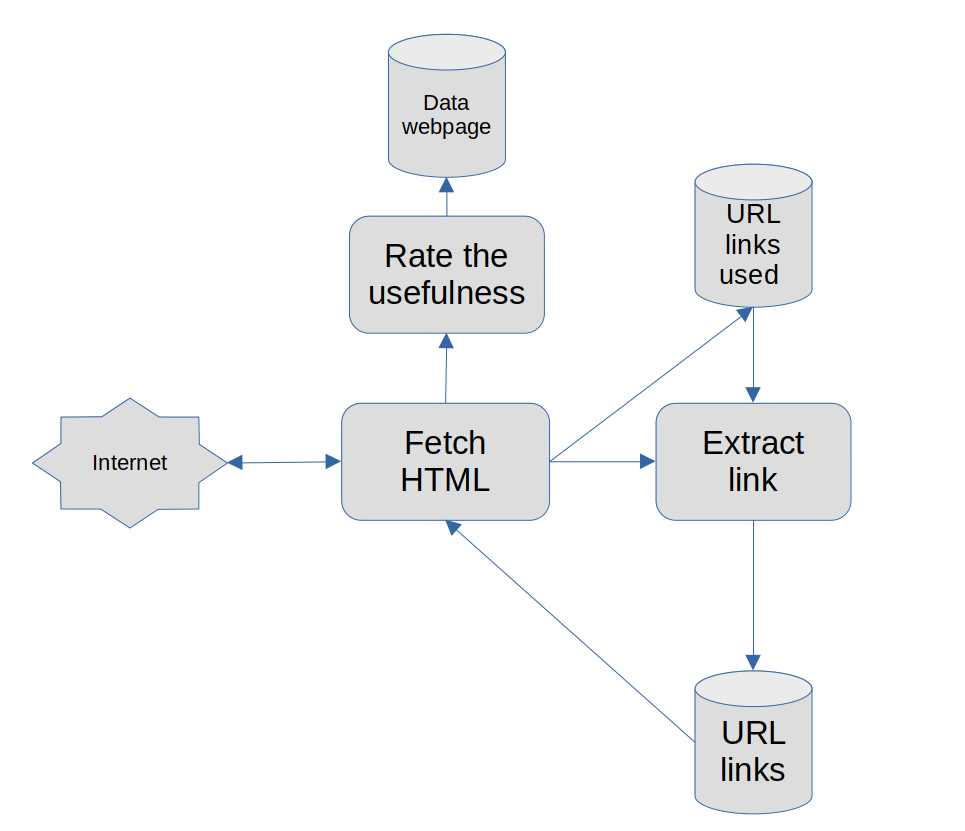

#  Design component

This is design component make by me.

1. **URL links:** To store link to scrape data.
2. **URL links used:** To store links have been scrape.
3. **Extract link**: To get several links in the website.
4. **Fetch HTML**: Get HTML file from URL from Internet
5. **Rate the usefulness**: To rate the usefulness of the website.
6. **Data web page**: To store data of websites have been crape.

# Explain detail 

1.  Initial, we have 100 link stored at URL inks. 
2. For each link in URL links. We fetch HTML from this link.
3. Create three threads, first thread has mission extract sub-links in the HTML file. Second thread add the link we just fetch to URL links used.
4. Links from the Extract link that is in the URL links used will be removed before being included in URL links.
5. Third thread has mission to estimate the rank usefulness of HTML file by information that we want.
6. If the Data web page stored less than 1000 websites, push the HTML file from step 5 to this with the rank usefulness of them. Else, replace websites if the rank usefulness of HTML file from step 5 is greater than min rank in Data web page.

